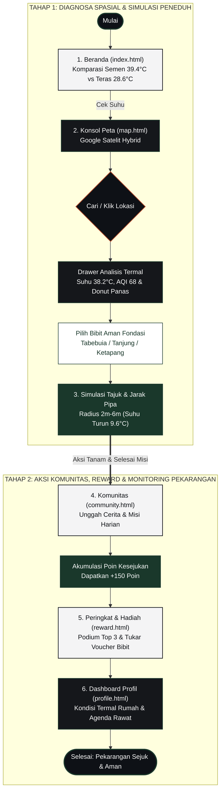

# USER FLOW MASTER PLATFORM TEDUH (SINGLE BALANCED DIAGRAM)

Berikut adalah satu-satunya diagram **User Flow Utama (Master Flowchart)** yang menggabungkan seluruh alur platform Teduh dalam satu bagan utuh berproporsi seimbang.

